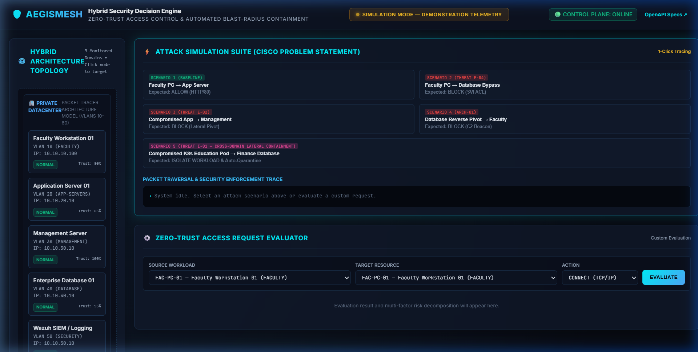
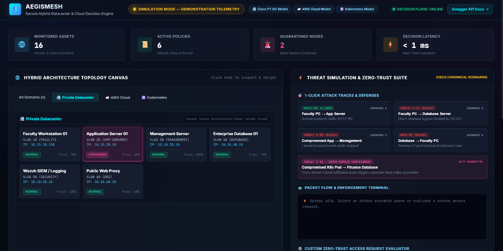
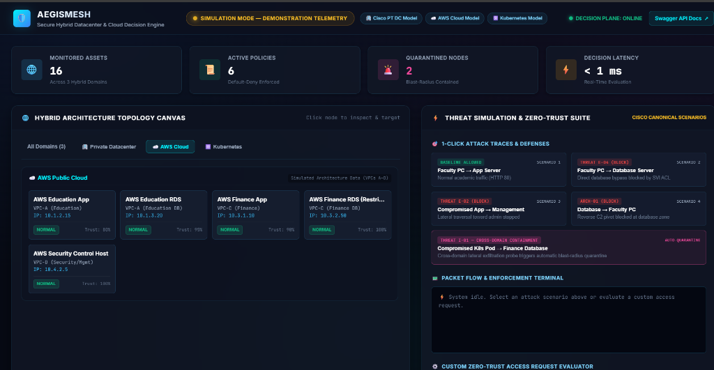
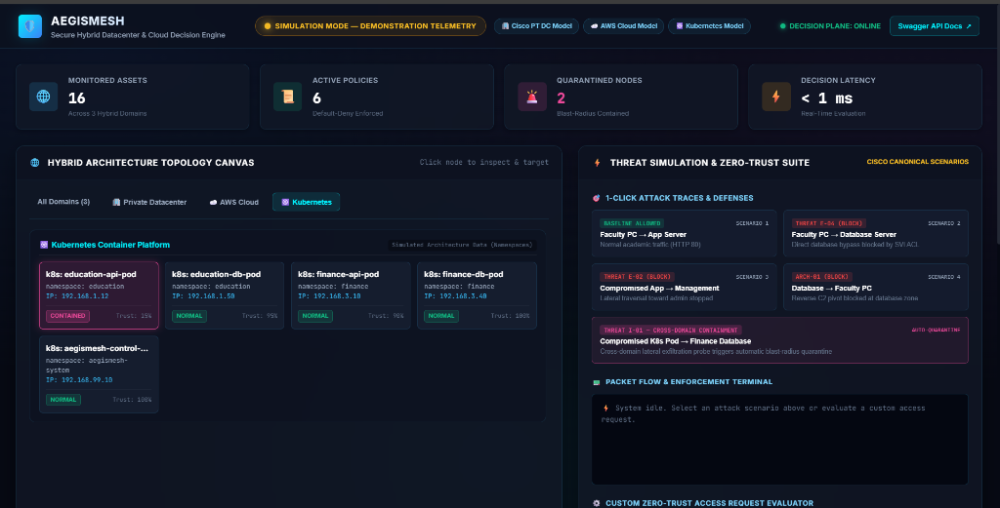
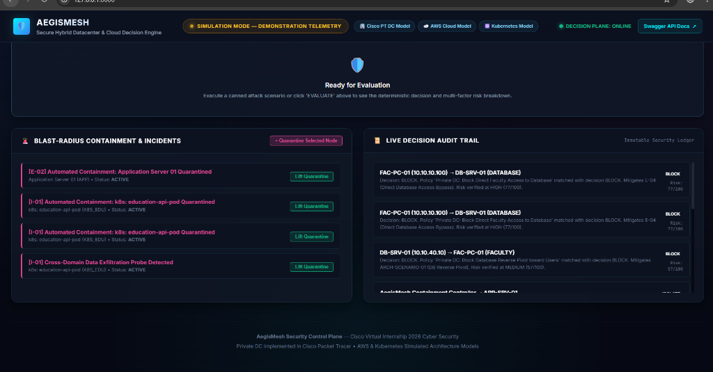

# AegisMesh

<div align="center">


</div>

> **Secure Hybrid Datacenter and Cloud Security Architecture & Decision Engine**  
> Cisco Virtual Internship 2026 — Cyber Security Project

---

## Executive Overview

An enterprise operates a hybrid infrastructure spanning a **private datacenter** and **public cloud (AWS)**. Workloads run as traditional server applications and Kubernetes-orchestrated microservices. The challenge: **how do we prevent lateral movement after compromise?**

> **Primary Security Objective:** If one application or workload is compromised, the compromise must not be able to spread laterally to unauthorized applications, VPCs, Kubernetes workloads, or the datacenter.

**AegisMesh** is the security control and decision architecture that enforces this objective across all infrastructure domains through **Zero-Trust policy evaluation**, **multi-factor risk scoring**, and **dynamic containment**.

---

## 📸 Interactive Cyber Command Center Dashboard

The AegisMesh platform includes an interactive, glassmorphic Cyber Command Center web dashboard (`http://localhost:8000/`) allowing evaluators to inspect the hybrid topology, run canned attack simulations, and observe real-time containment decisions.

| Command Center View | Architectural Coverage & Features |
|---|---|
|  | **Executive Command Center:** Real-time KPI stat bar, 1-click threat simulation suite, live packet flow terminal, and custom Zero-Trust decision traceability. |
|  | **Private Datacenter Domain:** Cisco Packet Tracer architecture model (VLANs 10–60, SVI routing, and extended ACL enforcement). |
|  | **AWS Public Cloud Domain:** Multi-VPC architecture (VPCs A–D), tiered subnets, and security group isolation boundaries. |
|  | **Kubernetes Container Domain:** Namespace isolation (`education`, `research`, `finance`), RBAC, and Calico default-deny NetworkPolicies. |
|  | **Containment & Audit Stream:** Active incident quarantine management, 1-click remediation, and immutable security decision ledger. |

👉 **[View the Complete 2-3 Minute Demonstration Walkthrough Guide](docs/demonstration-guide.md)**

---

## Solution Architecture

AegisMesh implements a **three-domain security architecture** with defense-in-depth controls at every layer:

```
                         ┌─────────────────────┐
                         │   USERS / FACULTY    │
                         │  Campus + Remote VPN │
                         └──────────┬──────────┘
                                    │
                         ┌──────────┴──────────┐
                         │   IDENTITY / IAM     │
                         │   MFA + RBAC + Tokens│
                         └──────────┬──────────┘
                                    │
             ┌────────────────────────┼────────────────────────┐
             │                        │                        │
  ┌──────────┴──────────┐  ┌─────────┴─────────┐  ┌──────────┴────────┐
  │  PRIVATE DATACENTER │  │    AWS CLOUD       │  │  KUBERNETES CLUSTER │
  │                     │  │                    │  │                     │
  │  6 VLANs + ACLs     │  │  4 VPCs + SGs      │  │  5 Namespaces       │
  │  SVI Routing        │  │  IAM Policies      │  │  NetworkPolicies    │
  │  Trunk Hardening    │  │  NACLs             │  │  RBAC + PSS         │
  │  VTY Restriction    │  │  CloudTrail Logs   │  │  Resource Quotas    │
  │                     │  │                    │  │                     │
  │  ✅ IMPLEMENTED     │  │  ✅ TERRAFORM IaC  │  │  ✅ IMPLEMENTED     │
  │  ✅ VALIDATED (PT)  │  │  ✅ VALIDATED (IaC)│  │  ✅ VALIDATED (K8s) │
  └──────────┬──────────┘  └─────────┬──────────┘  └─────────┬──────────┘
             │                       │                        │
             └───────────────────────┼────────────────────────┘
                                    │
                         ┌──────────┴──────────┐
                         │   AEGISMESH ENGINE   │
                         │   Policy + Risk +    │
                         │   Containment        │
                         │   (FastAPI Backend)  │
                         └──────────┬──────────┘
                                    │
                         ┌──────────┴──────────┐
                         │  COMMAND DASHBOARD  │
                         │  Live SOC Telemetry │
                         └─────────────────────┘
```

---

## ⚡ Quickstart — Running the Platform & Automated Validation

### 1. Launch Interactive Cyber Command Center
AegisMesh is fully runnable locally with zero external database dependencies:

```powershell
# Install lightweight Python dependencies
pip install -r requirements.txt

# Launch the single-command runner (starts FastAPI backend & opens Dashboard)
python run.py
```

- **Interactive Cyber Command Center:** [`http://127.0.0.1:8000/`](http://127.0.0.1:8000/) *(Opens automatically in your browser)*
- **OpenAPI / Swagger Documentation:** [`http://127.0.0.1:8000/api/docs`](http://127.0.0.1:8000/api/docs)

---

### 2. Run Multi-Domain Automated Test Suites

```powershell
# 1. Backend Security Engine & Unit/Integration Tests (18 tests)
python -m pytest backend/tests/

# 2. Kubernetes Dynamic Containment Bridge Live Validation (6 phases)
python testing/kubernetes/test_containment_bridge.py

# 3. Hybrid End-to-End Zero-Trust Security Validation (5 scenarios)
python testing/end-to-end/run_e2e_tests.py

# 4. AWS Zero-Trust Local Simulation & Security Suite (8 controls)
powershell -ExecutionPolicy Bypass -File .\testing\aws\deploy-localstack.ps1

# 5. AWS Terraform Static Syntax & Format Verification
cd aws/terraform
terraform init -backend=false
terraform validate
terraform fmt -check
cd ../..
```

---

## 📊 Project Validation Metrics

### Automated Executable Validations (37 / 37 PASSED)
| Domain / Test Suite | Target Environment | Execution Model | Passing Tests |
| :--- | :--- | :--- | :---: |
| **Backend Decision Engine** | FastAPI + 6-Factor Risk Scorer | **LIVE Local Execution** | **18 / 18 PASS** |
| **Kubernetes Dynamic Containment** | Kind Cluster + Project Calico CNI | **LIVE Local Cluster Execution** | **6 / 6 PHASES PASS** |
| **Hybrid End-to-End Suite** | Full Decision & Multi-Domain Pipeline | **LIVE Hybrid Verification** | **5 / 5 SCENARIOS PASS** |
| **AWS Zero-Trust Cloud** | 3-Tier Multi-AZ VPC + Security Groups | **LOCAL SIMULATION (Moto/LocalStack)** | **8 / 8 CONTROLS PASS** |
| **SUBTOTAL AUTOMATED TESTS** | | | **37 / 37 PASSED** |

### Empirical Network Simulation & IaC Static Checks (30 / 30 PASSED)
| Domain / Component | Target Environment | Verification Model | Result |
| :--- | :--- | :--- | :---: |
| **Private Datacenter Network** | Cisco Core/Access Switches + SVIs | **CISCO PACKET TRACER SIMULATION** | **30 / 30 EMPIRICAL PASS** |
| **AWS Terraform IaC** | Root & Reusable Terraform Modules | **STATIC SYNTAX & FORMAT VALIDATION** | **0 ERRORS / VALID** |

> [!NOTE]
> **Domain Execution Model Clarifications:**
> - **37 Automated Executable Validations:** Fast, automated regression tests spanning Python backend logic (18 tests), live Kubernetes Calico NetworkPolicy kernel-level packet drops (6 phases), hybrid end-to-end scenarios (5 scenarios), and local AWS Moto/LocalStack Zero-Trust security assertions (8 controls).
> - **30 Cisco Packet Tracer Simulation Checks:** Empirical validation matrix executed inside Cisco Packet Tracer 8.2+ verifying VLAN segmentation (10/20/30/40/50/60/99) and SVI extended ACL line-match counters.
> - **AWS Cloud Cost Notice:** AWS infrastructure definitions are provided as production-style Terraform IaC and validated against a **local AWS API simulation**. *No real AWS cloud resources are required or provisioned during validation ($0 cost).*

---

## Key Security Features

| # | Feature | Implementation |
|:---:|---|---|
| 1 | **Hybrid Connectivity** | IPsec VPN between Private DC and AWS VPC-D (architecturally designed) |
| 2 | **Cloud VPC Segmentation** | 4 isolated VPCs: Education, Research, Finance, Security/Management |
| 3 | **Public/Private Subnet Architecture** | Tiered subnets; Finance VPC has zero public subnets |
| 4 | **IAM/RBAC with Least Privilege & MFA** | Per-domain IAM roles with explicit cross-domain deny; MFA enforced |
| 5 | **Cloud Security Groups** | Per-instance SG rules; SG-to-SG references; default deny inbound |
| 6 | **Application Isolation** | VLANs (DC) + VPC boundaries (AWS) + NetworkPolicies (K8s) |
| 7 | **Lateral Movement Prevention** | ACLs, VPC isolation, default-deny NetworkPolicies at every boundary |
| 8 | **Kubernetes Security** | RBAC, Pod Security Standards, ResourceQuotas, ServiceAccount isolation |
| 9 | **Namespace Isolation** | Default-deny ingress/egress per namespace; no cross-namespace traffic |
| 10 | **Secure Faculty Remote Access** | VPN + MFA; same restrictions as on-campus; split tunnel disabled |
| 11 | **Zero Trust Architecture** | No implicit trust from network location; continuous evaluation |
| 12 | **Monitoring & Security Logging** | Dedicated Security VLAN 50, immutable decision audit ledger |
| 13 | **Incident Containment** | AegisMesh blast-radius controller; dynamic policy lockdown |

---

## Technology Stack

| Layer | Technology | Purpose |
|---|---|---|
| **Private Datacenter** | Cisco Packet Tracer 8.2+ | Enterprise network simulation with VLAN/ACL enforcement |
| **Security Decision Engine** | Python 3.12, FastAPI, Pydantic | Centralized zero-trust evaluation, 6-factor risk scoring, containment |
| **Cyber Dashboard** | Modern HTML5, Vanilla CSS Glassmorphism, ES6 | Interactive hybrid topology, live packet traces, risk gauges, incident management |
| **Cloud (Architecture & IaC)** | AWS + Terraform + Moto/LocalStack | Production 3-Tier Multi-AZ VPC & Zero-Trust Security Groups (locally validated) |
| **Containers (Platform)** | Kubernetes (kind) + Calico CNI | Live namespace isolation with dynamic NetworkPolicy automated containment |
| **Verification & Testing** | Pytest, Boto3, Terraform CLI, Packet Tracer | Multi-domain automated regression and security validation suites |

---

## Implementation Status

| Component | Status | Evidence |
|---|---|---|
| **Private Datacenter Network** | **IMPLEMENTED (PT SIMULATION)** | Cisco Packet Tracer topology (`packet-tracer/topology.pkt`) |
| **VLAN Segmentation (6 zones)** | **IMPLEMENTED (PT SIMULATION)** | `show vlan brief`, device configurations |
| **Extended ACL Enforcement** | **IMPLEMENTED (PT SIMULATION)** | `show access-lists` with verified match counters |
| **Trunk Hardening (DTP, Native VLAN 99)** | **IMPLEMENTED (PT SIMULATION)** | `show interfaces trunk` |
| **VTY Management Isolation** | **IMPLEMENTED (PT SIMULATION)** | `MGMT-VTY-ACCESS` ACL on VTY lines |
| **AegisMesh Security Engine** | **IMPLEMENTED (LIVE LOCAL)** | FastAPI backend with zero-trust policy, risk, decision, and containment engines (18/18 pytest passing) |
| **Cyber Command Center Dashboard** | **IMPLEMENTED (LIVE LOCAL)** | Interactive web dashboard served live at `http://localhost:8000/` |
| **Kubernetes Security Platform** | **IMPLEMENTED (LIVE LOCAL K8S)** | Kind cluster + Project Calico CNI + RBAC + NetworkPolicies (`testing/kubernetes/run-k8s-tests.ps1`) |
| **Dynamic Containment Bridge** | **IMPLEMENTED (LIVE LOCAL K8S)** | AegisMesh $\to$ Kubernetes API $\to$ Calico Dynamic Isolation & Release (6/6 phases passing) |
| **Automated End-to-End Test Suite** | **IMPLEMENTED (LIVE HYBRID)** | 5/5 Scenarios passing (`testing/end-to-end/run_e2e_tests.py`) |
| **AWS Cloud Infrastructure** | **IMPLEMENTED (IaC & LOCAL SIMULATION)** | Production 3-Tier Multi-AZ Terraform modules + LocalStack security validator (8/8 controls passing) |
| **Threat Model (STRIDE)** | **COMPLETED & DOCUMENTED** | 21 threats, 11 trust boundaries, attack trees |
| **Threat Traceability** | **COMPLETED & DOCUMENTED** | 14-row authoritative threat matrix (`docs/threat-traceability.md`) |

---

## Repository Structure

```
AegisMesh/
├── README.md                                    # Project overview & validation documentation (this file)
├── requirements.txt                              # Python backend & testing dependencies
├── run.py                                        # Single-command launcher (FastAPI + Dashboard)
├── .gitignore                                   # Repository hygiene rules
│
├── backend/                                     # AegisMesh Security Decision Engine
│   ├── app/
│   │   ├── main.py                               # FastAPI entry point & static mounting
│   │   ├── models/                               # Domain enums & Pydantic request/response schemas
│   │   ├── database/                             # In-memory store & seed data engine
│   │   ├── policy_engine/                        # Zero-Trust policy matcher & default-deny rules
│   │   ├── risk_engine/                          # 6-factor composite risk scorer (0–100)
│   │   ├── decision_engine/                      # Decision matrix combiner & human rationale generator
│   │   ├── containment/                          # Blast-radius state machine & k8s containment bridge
│   │   └── api/v1/                               # REST API endpoints (/decide, /simulate, /containment)
│   └── tests/
│       ├── test_engine.py                        # Risk & decision engine tests (8 tests)
│       ├── test_k8s_bridge.py                    # Containment bridge tests (5 tests)
│       └── test_e2e_scenarios.py                 # Core scenario tests (5 tests)
│
├── frontend/                                    # Interactive Cyber Command Center Dashboard
│   ├── index.html                                # Executive dashboard single-page interface
│   ├── css/
│   │   └── dashboard.css                         # Dark glassmorphism, responsive grid, status badges
│   └── js/
│       ├── api.js                                # REST client for backend communication
│       ├── topology.js                           # Interactive SVG hybrid topology renderer
│       ├── simulator.js                          # Attack scenario simulator & packet flow animator
│       └── app.js                                # Main controller & live telemetry manager
│
├── aws/                                         # AWS Cloud Zero-Trust Infrastructure (Terraform IaC)
│   ├── README.md                                # AWS architecture & local validation instructions
│   ├── architecture/
│   │   └── aws-zero-trust-architecture.md       # Detailed cloud security architecture specification
│   └── terraform/                               # Production Terraform Codebase
│       ├── main.tf                              # Root module assembling VPC and Security Groups
│       ├── providers.tf                         # AWS provider declaration & global tagging
│       ├── variables.tf                         # Input variables with strict CIDR validations
│       ├── outputs.tf                           # VPC, Subnet, and Security Group resource IDs
│       ├── versions.tf                          # Terraform and AWS provider versions
│       ├── terraform.tfvars.example             # Sample configuration values
│       └── modules/
│           ├── vpc/                             # 3-Tier Multi-AZ VPC module (Public/Private/Isolated)
│           └── security-groups/                 # Zero-Trust mutual SG referencing module
│
├── kubernetes/                                  # Kubernetes Security Platform (Kind + Calico)
│   ├── cluster/                                 # Kind cluster manifest with custom networking
│   ├── namespaces/                              # Namespace isolation definitions (education, finance)
│   ├── network-policies/                        # Default-deny Calico NetworkPolicies
│   ├── rbac/                                    # Role, RoleBinding, and ServiceAccount manifests
│   ├── workloads/                               # Microservice workload deployments & test clients
│   └── tests/                                   # Kubernetes testing manifests
│
├── testing/                                     # Multi-Domain Automated Test Suites
│   ├── aws/                                     # AWS LocalStack / Moto simulation test suite
│   │   ├── README.md                            # LocalStack testing instructions
│   │   ├── docker-compose.yml                   # Lightweight Moto container definition
│   │   ├── deploy-localstack.ps1                # PowerShell automated deploy & test runner
│   │   ├── destroy-localstack.ps1               # PowerShell clean teardown script
│   │   ├── validate_aws_security.py             # 8-Control Zero-Trust security validation script
│   │   └── terraform-localstack/                # LocalStack-targeted Terraform configuration
│   ├── kubernetes/                              # Kubernetes containment integration suite
│   │   ├── run-k8s-tests.ps1                    # Baseline NetworkPolicy validation runner
│   │   ├── test_containment_bridge.py           # 6-phase dynamic Calico containment test
│   │   └── test_containment_bridge.ps1          # PowerShell containment test runner
│   ├── end-to-end/                              # Unified hybrid end-to-end validation suite
│   │   ├── run_e2e_tests.py                     # 5-scenario hybrid Zero-Trust validation engine
│   │   └── run_e2e_tests.ps1                    # PowerShell E2E test runner
│   └── packet-tracer/                           # Cisco DC test definitions
│       └── test_svi_acls.py                     # SVI ACL policy specification checks
│
├── architecture/                                # Professional Architecture Documents
│   ├── hybrid-architecture.md                   # Unified hybrid datacenter + cloud architecture
│   ├── network-segmentation.md                  # Cross-domain segmentation strategy
│   ├── iam-security-model.md                    # IAM, RBAC, MFA, Zero Trust, remote access
│   ├── kubernetes-security.md                   # K8s namespace isolation & security
│   └── threat-model-summary.md                  # Executive threat model with attack trees
│
├── docs/                                        # Detailed Specifications & Documentation
│   ├── demonstration-guide.md                   # 2-3 minute executive evaluation walkthrough
│   ├── architecture-overview.md                 # Quick evaluator orientation guide
│   ├── kubernetes-containment-bridge.md         # Dynamic Calico containment architecture & API
│   ├── security-controls-summary.md             # Unified security controls catalog
│   ├── threat-traceability.md                   # Authoritative threat traceability matrix
│   ├── security-control-traceability.md         # Control-to-test mapping
│   ├── assets/                                  # Dashboard demonstration screenshots
│   ├── testing/                                 # Test reports & validation evidence
│   │   ├── testing-strategy.md                  # Unified 5-level testing strategy
│   │   ├── e2e-validation-report.md             # Automated E2E test execution report
│   │   └── aws-validation-report.md             # Automated AWS LocalStack validation report
│   └── architecture/                            # Per-Domain Design Specifications
│       ├── architecture.md                      # System architecture & component model
│       ├── network-design.md                    # Private DC VLAN/ACL design
│       ├── aws-design.md                        # AWS VPC/IAM/SG design
│       ├── kubernetes-design.md                 # K8s namespace/RBAC/NetworkPolicy
│       ├── aegismesh-design.md                  # Security engine API design
│       └── threat-model.md                      # Complete STRIDE analysis
│
└── packet-tracer/                               # Cisco Packet Tracer Implementation
    ├── topology.pkt                             # Packet Tracer binary topology file
    ├── handoff-package.md                       # Self-contained teammate execution guide
    ├── configs/
    │   └── SW-CORE-STAGE-A.txt                  # Stage A baseline (no ACL bindings)
    ├── configurations/                          # Stage B hardened device configurations
    │   ├── SW-CORE.txt                          # Core L3 switch (SVIs + ACLs)
    │   ├── R-EDGE.txt                           # Edge router
    │   ├── SW-ACCESS-1.txt                      # Access switch 1 (Faculty + DMZ)
    │   ├── SW-ACCESS-2.txt                      # Access switch 2 (App + DB)
    │   ├── SW-ACCESS-3.txt                      # Access switch 3 (Mgmt + Security)
    │   └── build-guide.md                       # Port/cabling reference
    ├── acl/                                     # ACL design documentation
    └── test-results/                            # Validation Results
        ├── validation-summary.md                # Empirical test results (VERIFIED)
        └── test-matrix.md                       # 30-test security matrix
```

---

## License & Evaluation Notice

This project is developed exclusively for the **Cisco Virtual Internship 2026 Cyber Security** program.

---

## Status

**Current Phase:** Final Integration & Polish Complete — 37 / 37 Automated Validations Passing across Backend, Kubernetes, AWS, and Hybrid E2E Suites.
